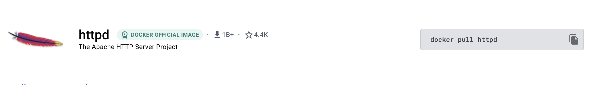
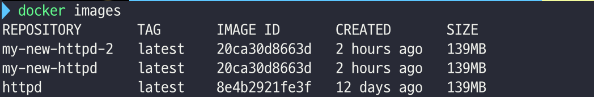
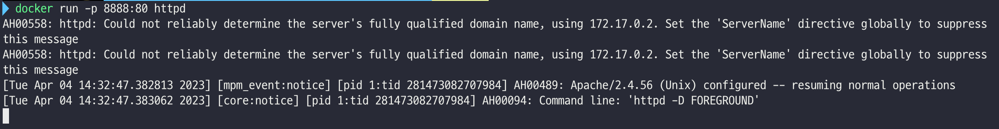
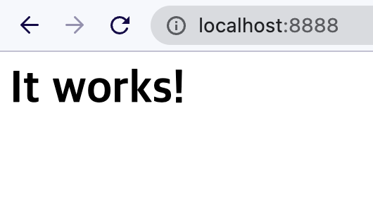
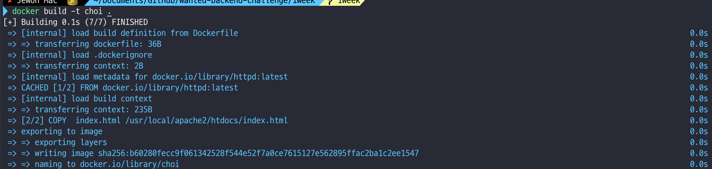
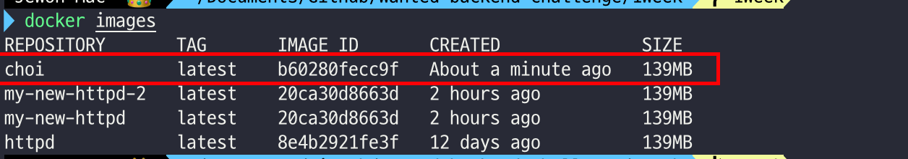
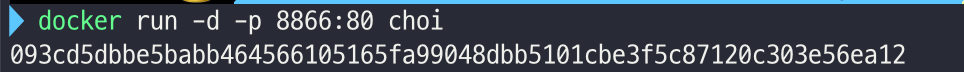
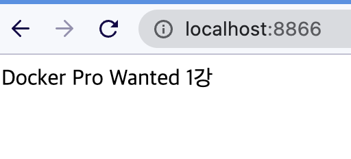

# 1주차

4월 원티드 프리 온보딩 챌린지 - docker 뿌시기 1첫번째 수업 정리

## I. Docker 이론

---

### Q1. Dokcer ?

- 컨테이너 기반 `가상화` 도구

  - 리눅스 컨테이너 기술인 LXC(Linux Containers) 기반

- 애플리케이션을 `컨테이너`라는 단위로 격리하여 실행하고 배포하는 기술

- 다양한 운영 체제에서 사용 할 수 있으며, 컨테이너화된 애플리케이션을 손쉽게 빌드, 배포 관리할 수 있는 다양한 기능 제공

- 위 기능들을 통해 애플리케이션을 빠르게 개발, 효율적으로 배포, 관리 가능

### Q2. Docker Architecture

- `Docker daemon`

  - 도커 엔진의 핵심 구성 요소
  - 도커 호스트에서 컨테이너를 관리하고 실행한느 역할
  - 컨테이너 생성, 시작, 중지, 삭제하는 등의 작업 실행
  - 컨테이너 이미지 관리
  - 외부에서 이미지를 다운로드, 빌드 작업 수행

- `Docker Client`

  - Docker와 상호 작용
  - docker 명령어를 사용하면 docker daemon으로 보내어 실행

- `Dcoker Object`
  - `Docker Image`
    - 도커 컨테이너를 만들기 위한 읽기 전용 템플릿
  - `Docker Container`
    - 한 도커 이미지의 실행 가능한 인스턴스
    - 애플리케이션을 실행하기 위한 모든 파일과 설정 정보를 포함하는 패키지

### II. 실습편

---

### 1. 이미지 Pull 받아 사용해보기



### 1-1. [Docker Hub](https://hub.docker.com/, "docker hub Link")에서 httpd image pull 받기

```
docker pull httpd
```

### 1-2. docker image 확인하기

```
docker images
```



### 1-3. docker image 컨테이너화 실행 시키기

```
docker run httpd
docker run -p 8888:80 httpd // -p는 본인의 포트 번호 재설정
```




## 2. Dockerfile 활용하여 자신만의 도커 이미지 만들기

---

### 2.1 Dockerfile 설정 (현재 레포지토리에 있는 Dockerfile 참조)

```
FROM httpd:latest
// 뿌리는 pull받은 httpd에서 시작
COPY  index.html /usr/local/apache2/htdocs/index.html
// 기존 respository에 존재하는 index를 현재 index로 재설정
EXPOSE 80
// 포트 80번 개방
```

### 2.2 이미지 만들기

```
docker build -t choi .
```



### 2.3 이미지 확인

```
docker images
```



### 2.4 도커파일로 생성된 이미지로 컨테이너 실행

```
docker run -d -p 8866:80 choi
```



